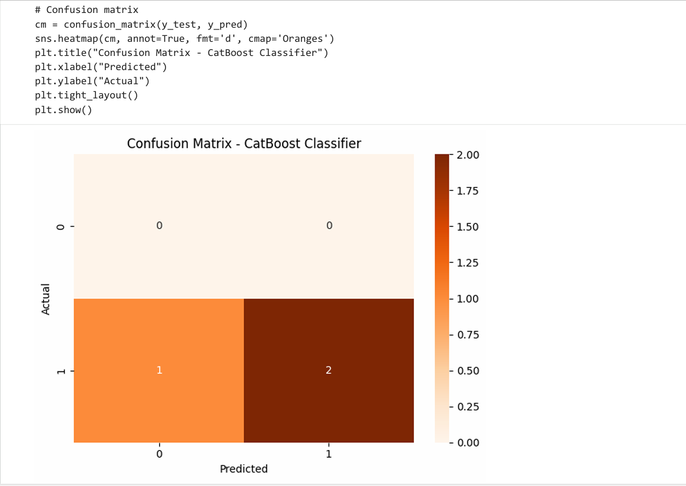

### CatBoost Classifier on Tabular Data with Categorical Features

This project demonstrates how to build and evaluate a CatBoost Classifier on a small tabular dataset containing both categorical and numerical features. CatBoost (Categorical Boosting), developed by Yandex, is a gradient boosting library designed to handle categorical variables natively, reducing the need for heavy preprocessing.

### 📌 Project Overview

The goal of this project is to:

Train a CatBoost classifier on a mixed-type dataset

Handle categorical features using CatBoost’s built‑in capabilities

Evaluate model performance using classification metrics

Visualize results with a confusion matrix

The dataset includes:

Education (categorical)

Experience (numerical)

Department (categorical)

Target (binary classification label)

### 📁 Dataset

A small simulated dataset is used:

Education: Bachelors, Masters, PhD

Experience: Years of experience

Department: HR, IT, Finance

Target: 0 or 1

### Model: CatBoostClassifier

model = CatBoostClassifier(
    iterations=100,
    learning_rate=0.1,
    depth=4,
    verbose=0
)

### 🔧 Training Pipeline

Split data into training and testing sets

Train CatBoost on the training data

Predict on the test set

Generate evaluation metrics

### 📊 Evaluation

The project outputs:

Classification Report

Precision

Recall

F1‑score

Confusion Matrix  
Visualized using Seaborn’s heatmap to show prediction performance.

### 📦 Dependencies

catboost

pandas

numpy

scikit‑learn

seaborn

matplotlib

Install CatBoost if needed: pip install catboost

### 🖼 Output

🎯 Key Takeaways

CatBoost handles categorical features without manual encoding

Works efficiently on small and large tabular datasets

Provides strong performance with minimal preprocessing

Easy to integrate with scikit‑learn tools

